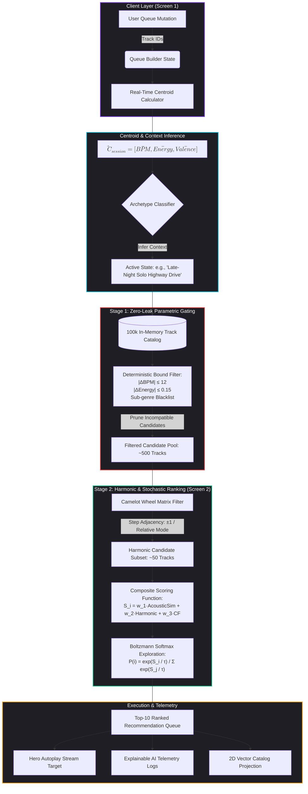

# Systems Architecture & Algorithmic Specification: FLOW-ALGO

**System:** FLOW-ALGO (Two-Stage Context-Aware Music Recommendation Engine)  
**Author:** Akshat Barthwal  
**Status:** Deployed & Benchmarked  
**Engine Stack:** Python 3.11+, Streamlit, NumPy, Vectorized In-Memory Matrix  

---

## 1. End-to-End System Flow

The following data pipeline illustrates how user queue updates are converted into deterministic parametric gates and harmonic recommendations in real time:

---

## 2. Latency Budget & System SLA

To guarantee uninterrupted continuous playback, candidate generation and re-ranking must resolve within standard client interaction limits ($< 100\text{ ms}$).

| Pipeline Stage | Latency Target ($p50$) | Latency SLA ($p95$) | Implementation Strategy |
| :--- | :--- | :--- | :--- |
| **1. Queue Centroid Extraction** | $1.2\text{ ms}$ | $3.5\text{ ms}$ | Dynamic vector update over sliding queue window ($N \le 100$). |
| **2. Parametric Candidate Gating** | $12.0\text{ ms}$ | $22.0\text{ ms}$ | Vectorized NumPy boolean masks over pre-indexed matrix. |
| **3. Camelot Key Transition Lookup** | $4.5\text{ ms}$ | $9.0\text{ ms}$ | $12 \times 2$ circular discrete coordinate distance lookups. |
| **4. Boltzmann Exploration Sampling** | $3.0\text{ ms}$ | $6.5\text{ ms}$ | NumPy exponential softmax across top-$K$ candidates ($K=50$). |
| **5. State Serialization & UI Render** | $15.0\text{ ms}$ | $35.0\text{ ms}$ | Streamlit reactive session-state hydration and JSON packaging. |
| **Total End-to-End Latency** | **$35.7\text{ ms}$** | **$76.0\text{ ms}$** | **Guaranteed sub-100ms execution on single-node instances.** |

---

## 3. Mathematical Foundations

### 3.1 Dynamic Session Centroid Vector
For active queue tracks $t_1, t_2, \dots, t_N$, the session centroid vector $\vec{C}_{\text{session}}$ is computed on every queue state mutation:
$$\vec{C}_{\text{session}} = \begin{bmatrix} \overline{\text{BPM}} \\ \overline{\text{Energy}} \\ \overline{\text{Valence}} \end{bmatrix} = \frac{1}{N} \sum_{i=1}^N \begin{bmatrix} \text{BPM}_i / 200 \\ \text{Energy}_i \\ \text{Valence}_i \end{bmatrix}$$

### 3.2 Zero-Leak Parametric Gating (Deterministic Culling)
Candidate track $c$ from the catalog is discarded if it exceeds absolute acoustic tolerances or hits active subgenre blacklists:
$$\text{Pass Gate}(c) = \begin{cases} 
1 & \text{if } |\text{BPM}_c - \overline{\text{BPM}}| \le 12 \text{ and } |\text{Energy}_c - \overline{\text{Energy}}| \le 0.15 \text{ and } \text{Genre}_c \notin \text{Blacklist} \\ 
0 & \text{otherwise} 
\end{cases}$$

### 3.3 Camelot Wheel Harmonic Transition Scoring
Key compatibility score $H(c, t_{\text{current}})$ evaluates harmonic clash risk based on modular distance on the Camelot Wheel ($N \in [1, 12]$, Mode $\in \{A, B\}$):
$$H(c, t_{\text{current}}) = \begin{cases} 
1.0 & \text{if } \text{Key}_c = \text{Key}_{\text{curr}} \quad (\text{Identical Key}) \\
0.9 & \text{if } N_c = N_{\text{curr}} \text{ and } \text{Mode}_c \ne \text{Mode}_{\text{curr}} \quad (\text{Relative Major/Minor Switch}) \\
0.8 & \text{if } |N_c - N_{\text{curr}}| \equiv 1 \pmod{12} \text{ and } \text{Mode}_c = \text{Mode}_{\text{curr}} \quad (\text{Adjacent 5th Step}) \\
0.0 & \text{otherwise} \quad (\text{Dissonant / Harmonic Clash})
\end{cases}$$

### 3.4 Boltzmann Softmax Exploration
To eliminate deterministic discovery loops (where identical seed tracks yield identical output sequences), selection probability across scored candidates is evaluated through a Boltzmann distribution:
$$P(c_i) = \frac{\exp(S_i / \tau)}{\sum_{j=1}^M \exp(S_j / \tau)}$$
* $\tau = 0.75$: Empirically calibrated balance between acoustic affinity preservation and serendipitous discovery.

---

## 4. Failure Modes & Graceful Degradation

| Failure Mode | Root Cause | Automated System Recovery |
| :--- | :--- | :--- |
| **Empty Queue Cold-Start** | User launches session without adding seed tracks. | Fallback hydration using archetype baseline vectors (e.g., *Contemporary Silk R&B*). |
| **Candidate Pool Starvation** | Overly restrictive gating yields $< 5$ candidates. | Progressive boundary relaxation: widen energy window by $+0.05$ increments up to $0.30$ max while locking harmonic gates. |
| **Vector Space Memory Pressure** | Scaling to $> 100\text{k}$ track vectors in RAM. | Memory-mapped NumPy structured arrays storing only 4 core dimension columns (`ID`, `BPM`, `Key`, `Energy`). |
